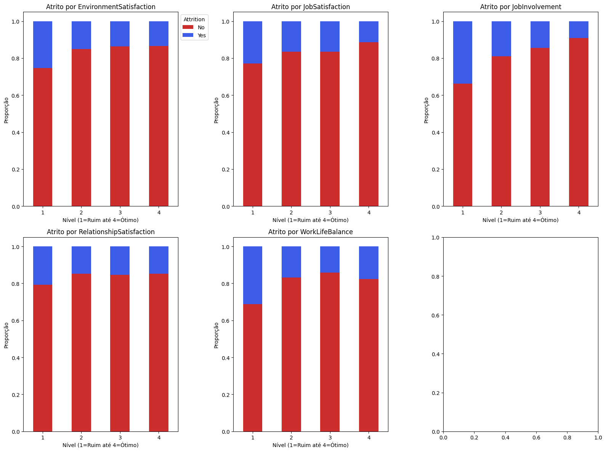
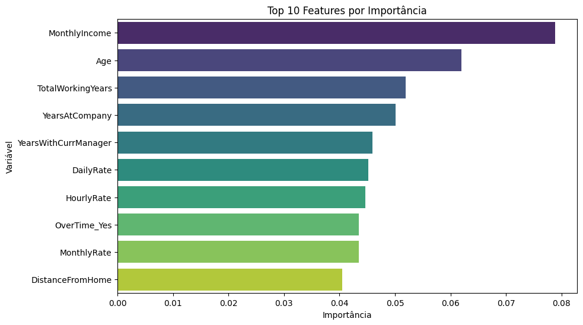

# Análise e Predição de Atrito de Funcionários (People Analytics)


> **Contexto de Negócio:** A rotatividade de funcionários (atrito/churn) representa um custo alto para as organizações, envolvendo gastos com novos processos seletivos, treinamento e perda de conhecimento tácito.

## Objetivo do Projeto
O objetivo central desta análise é identificar os **principais preditores de saída** dos colaboradores e construir um **modelo de Machine Learning** capaz de prever o risco de atrito. O estudo busca responder:
* Quais faixas etárias ou salariais apresentam maior propensão à saída?
* O excesso de trabalho (OverTime) e a baixa satisfação influenciam a decisão?
* É viável prever antecipadamente a saída de um colaborador?

## Dados Utilizados
O projeto utiliza o conjunto de dados **IBM HR Analytics Employee Attrition & Performance**.
* **Fonte:** [Kaggle / IBM](https://www.kaggle.com/datasets/pavansubhasht/ibm-hr-analytics-attrition-dataset)
* **Variável Alvo:** `Attrition` (Sim/Não).

## Tecnologias
* **Linguagem:** Python
* **Bibliotecas:** Pandas, NumPy, Matplotlib, Seaborn, Scikit-Learn.

## Insights da Análise Exploratória (EDA)

### 1. O Fator "Burnout" (Hora Extra)

> **Insight:** O gráfico de `OverTime` evidencia uma diferença significativa: a taxa de atrito eleva-se drasticamente entre colaboradores que trabalham além do horário. Adicionalmente, cargos de base como Vendedores (`Sales Representative`) e Técnicos de Laboratório apresentam rotatividade superior à de gestores.

### 2. O Perfil Financeiro e Demográfico

> **Insight:** Funcionários que saem ("Yes") possuem medianas consistentemente menores de **salário mensal**, **idade** e **tempo de empresa**. A estabilidade financeira e a senioridade atuam como fatores de retenção ("algemas de ouro").

### 3. A Zona de Perigo da Satisfação

> **Insight:** A análise de variáveis ordinais (1-4) revelou a criticidade do **Nível 1 (Ruim)**. Especialmente em `WorkLifeBalance` e `EnvironmentSatisfaction`, a taxa de saída no nível 1 aproxima-se do dobro em relação aos outros níveis. Observa-se tolerância à satisfação mediana, porém intolerância à insatisfação.

### 4. Ranking de Impacto (Correlação)

> **Resumo:** Em vermelho, os maiores impulsionadores de saída: **Hora Extra** e **Distância de Casa**. Em azul, os retentores: **Salário**, **Idade** e **Anos na Função**.

---

## Modelagem Preditiva (Machine Learning)

Utilizou-se um **Random Forest Classifier** para previsão do risco de saída. O desafio principal consistiu no desbalanceamento dos dados (apenas 16% de atrito real).

### Estratégia Adotada: Threshold Tuning (Ajuste de Limiar)
Um modelo padrão (corte em 50%) apresentaria alta acurácia, porém falharia na identificação de saídas (Recall baixo).
Para solução do problema, ajustou-se o limiar de decisão para **0.15**.

| Métrica | Limiar Padrão (0.50) | Limiar Ajustado (0.15) |
| :--- | :---: | :---: |
| **Recall (Detectar Saída)** | ~8% | **72%** |
| **Ação do RH** | Reativa (Perda do talento) | **Preventiva** (Ação antecipada) |

### Variáveis mais Importantes para o Modelo

> O modelo confirmou a EDA: **Renda Mensal (MonthlyIncome)**, **Idade** e **Tempo de anos em trabalho** constituem as características matemáticas mais fortes para determinação da permanência ou saída.

---

## Conclusão de Negócio

A análise aponta que o atrito nesta organização não ocorre de forma aleatória, sendo impulsionado por fatores estruturais.

1.  **Perfil de Risco:** Jovens, com baixos salários, realizadores de horas extras e com baixo equilíbrio vida/trabalho.
2.  **Random forest:** O modelo de ML desenvolvido identifica **72%** destes casos com antecedência.

## Como Executar

1.  Clone o repositório:
    ```bash
    git clone [https://github.com/1Pereira/people-analytics.git]
    ```
2.  Instale as dependências:
    ```bash
    pip install pandas numpy matplotlib seaborn scikit-learn
    ```
3.  Execute o Jupyter Notebook:
    ```bash
    jupyter notebook
    ```

## Autor

**Pereira**
* [LinkedIn](https://www.linkedin.com/in/joaovitorpereiracantadori/)
* [GitHub](https://github.com/1Pereira)