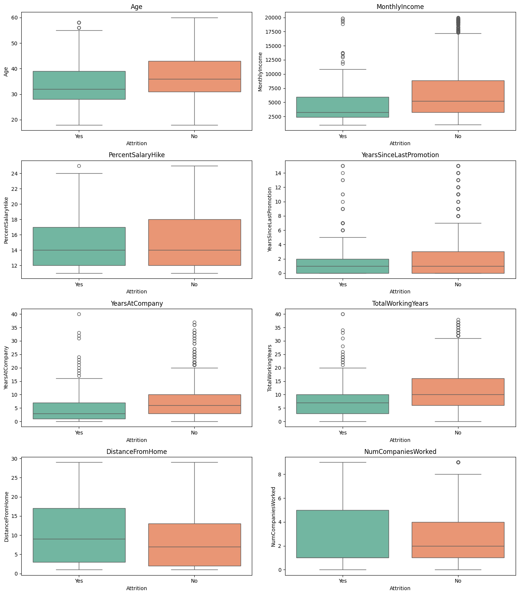
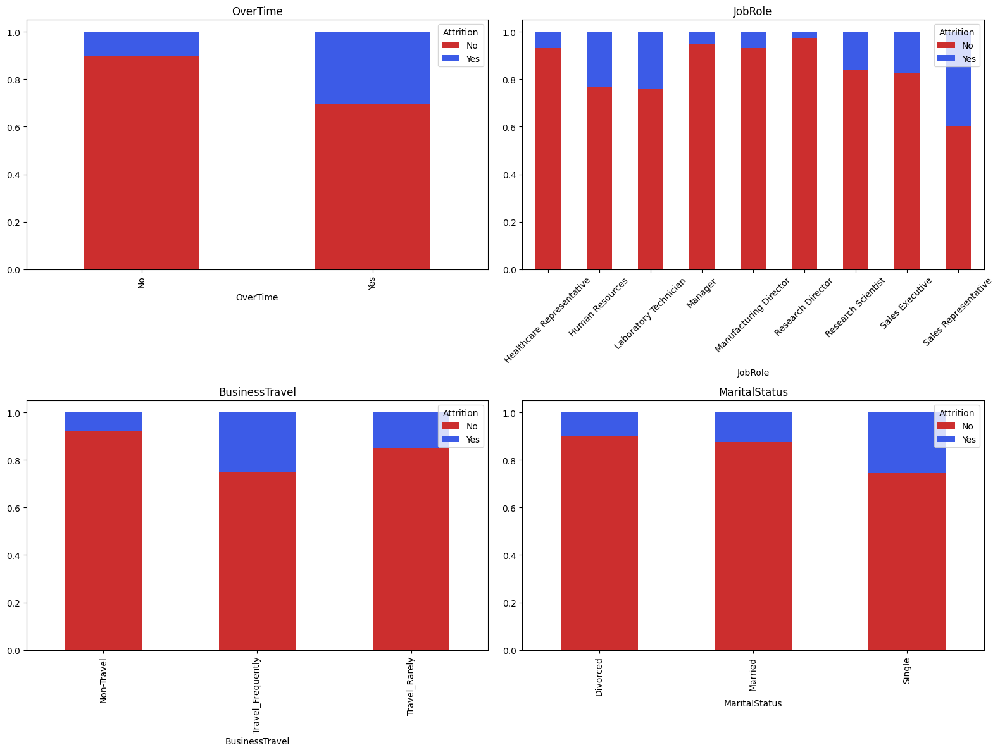
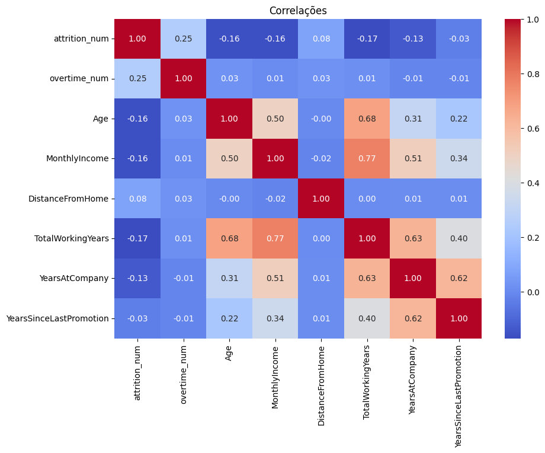

# Análise de Atrito de Funcionários (Employee Attrition)


> **Contexto de Negócio:** A rotatividade de funcionários (atrito/churn) representa um custo alto para as organizações, envolvendo gastos com novos processos seletivos, treinamento e perda de conhecimento tácito.

## Objetivo do Projeto
O objetivo central desta análise é identificar os **principais preditores de saída** dos colaboradores utilizando o dataset fictício de RH da IBM. Através de uma Análise Exploratória de Dados (EDA), buscamos responder:
* Quais faixas etárias ou salariais são mais propensas a sair?
* O excesso de trabalho (OverTime) influencia a decisão de saída?
* Quais correlações existem entre satisfação, tempo de empresa e atrito?

## Estrutura do Dataset
O projeto utiliza o conjunto de dados **IBM HR Analytics Employee Attrition & Performance**.
* **Fonte:** [Kaggle / IBM](https://www.kaggle.com/datasets/pavansubhasht/ibm-hr-analytics-attrition-dataset)
* **Registros:** Informações demográficas, histórico profissional e níveis de satisfação.
* **Variável Alvo:** `Attrition` (Sim/Não).

## Tecnologias e Ferramentas
* **Linguagem:** Python
* **Manipulação de Dados:** Pandas, NumPy
* **Visualização:** Matplotlib, Seaborn

## Etapas da Análise

### 1. Visão Geral e Limpeza
Verificação da integridade do dataset (tipagem, valores nulos e duplicatas). Garantia de que os dados estão prontos para exploração estatística.

### 2. Análise de Variáveis Numéricas
Investigação de variáveis contínuas como *Idade*, *Salário Mensal*, *Anos de Empresa* e *Distância de Casa*.
* Uso de Histogramas para distribuição e Boxplots para comparar o comportamento entre os grupos que saíram vs. ficaram.
* Identificação de discrepâncias salariais e padrões de estagnação na carreira.

### 3. Análise de Variáveis Categóricas
Investigação de fatores qualitativos como *Cargo (JobRole)*, *Hora Extra (OverTime)* e *Viagens (BusinessTravel)*.
* Gráficos de barras empilhadas 100% para visualizar a proporção de atrito dentro de cada categoria.

### 4. Correlação e Ranking de Impacto
Mapeamento da força das relações lineares entre as variáveis.
* **Matriz de Correlação:** Heatmap para identificar multicolinearidade.
* **Feature Importance** Ranking das variáveis que possuem maior correlação positiva ou negativa com a variável alvo `Attrition`.

## Visualizações
Abaixo estão os principais gráficos gerados pela análise e suas interpretações.

### 1. Distribuição Geral da Força de Trabalho

> **Visão Geral:** A visualização revela uma força de trabalho majoritariamente jovem e com salários concentrados nas faixas iniciais (assimetria positiva em `MonthlyIncome`), o que é comum em estruturas hierárquicas piramidais.

### 2. Perfil do Atrito (Comparativo Numérico)

> **Insight:** Comparando os grupos, nota-se que funcionários que saem ("Yes") possuem medianas consistentemente menores de **idade**, **salário mensal** e **tempo de empresa**. A estabilidade financeira e profissional parece atuar como um forte fator de retenção.

### 3. Fatores de Risco (Categorias)

> **Insight:** O gráfico de `OverTime` (Hora Extra) mostra uma diferença gritante: a taxa de atrito dispara entre quem trabalha além do horário. Além disso, solteiros (`Single`) e Vendedores (`Sales Representative`) apresentam rotatividade superior à média.

### 4. Matriz de Correlações

> **Análise Técnica:** Identificamos forte multicolinearidade entre `Age`, `TotalWorkingYears` e `MonthlyIncome` (0.77), indicando que essas variáveis carregam informações similares. O atrito (`attrition_num`) tem sua correlação positiva mais forte com `OverTime`

### 5. Ranking de Impacto nas Demissões

> **Insight:** Em vermelho, vemos os maiores impulsionadores de saída: **Hora Extra** e **Distância de Casa**. Em azul, os fatores de proteção: quanto maior o Tempo de Carreira, Salário e Idade, menor a chance do colaborador deixar a empresa.

## Conclusão e Insights de Negócio

Com base na análise exploratória, identificamos que o atrito nesta organização não é aleatório, mas sim impulsionado por fatores específicos de sobrecarga e estagnação profissional.

### Perfil de Risco (Quem estamos perdendo?)
O colaborador com maior probabilidade de saída possui o seguinte perfil:
* **Jovem e em início de carreira:** Baixa renda mensal e poucos anos de empresa.
* **Sobrecarregado:** Realiza horas extras.
* **Vendas/Técnico:** Atua como Representante de Vendas ou Técnico de Laboratório.
* **Solteiro:** Possui maior mobilidade geográfica e menor aversão ao risco.

### Próximos Passos
* Implementar um modelo de Machine Learning para prever a probabilidade de saída de funcionários atuais em tempo real.
* Analisar a variável de satisfação ambiental e satisfação com o trabalho para cruzar com os dados demográficos.

## Como Executar
Para rodar este notebook localmente:

1.  Clone o repositório:
    ```bash
    git clone [https://github.com/seu-usuario/nome-do-repo.git](https://github.com/seu-usuario/nome-do-repo.git)
    ```
2.  Instale as dependências:
    ```bash
    pip install pandas numpy matplotlib seaborn
    ```
3.  Execute o Jupyter Notebook:
    ```bash
    jupyter notebook
    ```

## Autor

**Pereira**
* [LinkedIn](https://www.linkedin.com/in/joaovitorpereiracantadori/)
* [GitHub](https://github.com/1Pereira)

---