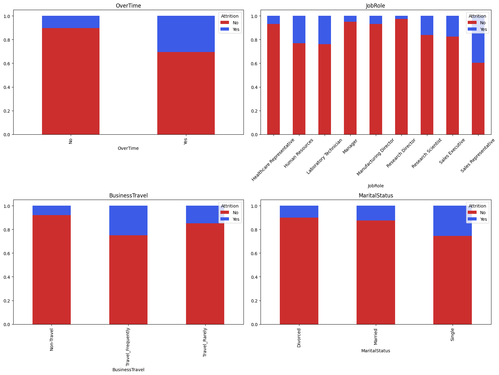
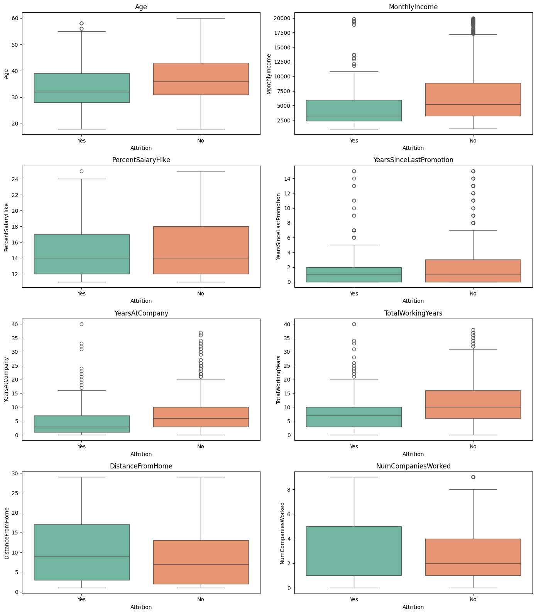
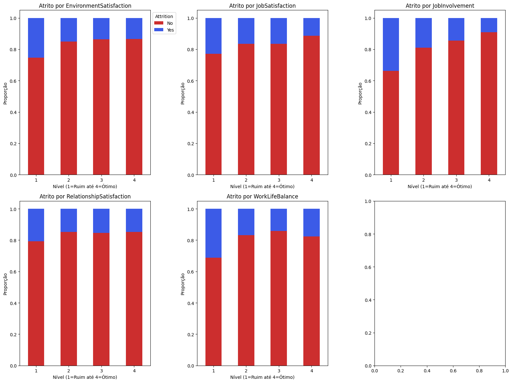
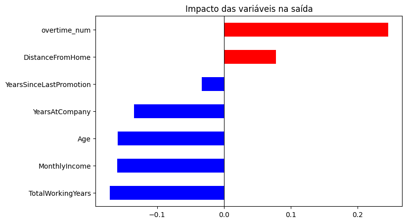
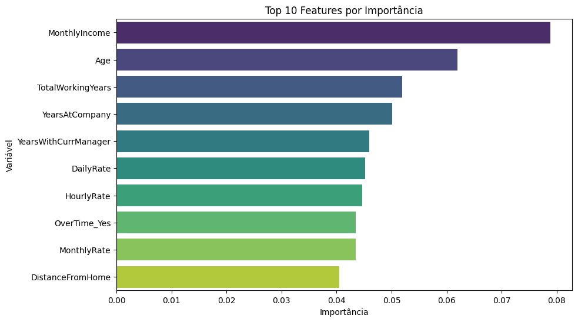

# Employee Attrition Analysis and Prediction (People Analytics)


> **Business Context:** Employee turnover (attrition/churn) represents a significant cost for organizations, involving expenses with new hiring processes, training, and the loss of tacit knowledge.

## Project Objective

The central objective of this analysis is to identify the **main predictors of employee departure** and build a **Machine Learning model** capable of predicting attrition risk. The study seeks to answer:

- Which age groups or salary ranges show a higher tendency to leave?
- Does overwork (OverTime) and low satisfaction influence the decision?
- Is it feasible to predict an employee's departure in advance?

## Dataset

The project uses the **IBM HR Analytics Employee Attrition & Performance** dataset.

- **Source:** [Kaggle / IBM](https://www.kaggle.com/datasets/pavansubhasht/ibm-hr-analytics-attrition-dataset)
- **Target Variable:** `Attrition` (Yes/No)

## Technologies

- **Language:** Python
- **Libraries:** Pandas, NumPy, Matplotlib, Seaborn, Scikit-Learn

---

## Exploratory Data Analysis (EDA) Insights

### 1. The Burnout Factor (Overtime)



> **Insight:** The `OverTime` chart reveals a significant difference: the attrition rate increases drastically among employees who work beyond regular hours. Additionally, entry-level roles such as Sales Representatives and Laboratory Technicians show higher turnover than managers.

### 2. The Financial and Demographic Profile



> **Insight:** Employees who leave ("Yes") consistently show lower medians in **monthly salary**, **age**, and **years at the company**. Financial stability and seniority act as retention factors ("golden handcuffs").

### 3. The Satisfaction Danger Zone



> **Insight:** Analysis of ordinal variables (1–4) revealed the criticality of **Level 1 (Poor)**. Especially in `WorkLifeBalance` and `EnvironmentSatisfaction`, the departure rate at level 1 is nearly double compared to other levels. Employees tolerate average satisfaction, but not dissatisfaction.

### 4. Impact Ranking (Correlation)



> **Summary:** In red, the strongest drivers of departure: **Overtime** and **Distance from Home**. In blue, the retention factors: **Salary**, **Age**, and **Years in Role**.

---

## Predictive Modeling (Machine Learning)

A **Random Forest Classifier** was used to predict attrition risk. The main challenge was class imbalance — only 16% of employees actually left.

### Strategy: Threshold Tuning

A default model (50% cutoff) would show high accuracy but fail to identify actual departures (low Recall). To address this, the decision threshold was adjusted to **0.15**.

| Metric | Default Threshold (0.50) | Adjusted Threshold (0.15) |
| :--- | :---: | :---: |
| **Recall (Detect Departures)** | ~8% | **72%** |
| **HR Action** | Reactive (talent already lost) | **Preventive** (early intervention) |

### Most Important Features



> The model confirmed the EDA findings: **Monthly Income**, **Age**, and **Total Working Years** are the strongest mathematical features for determining whether an employee will stay or leave.

---

## Business Conclusion

The analysis shows that attrition in this organization does not occur randomly — it is driven by structural factors.

1. **Risk Profile:** Young employees with low salaries, working overtime, and with poor work-life balance.
2. **Random Forest:** The ML model identifies **72%** of these cases in advance, enabling preventive HR action.

---

## How to Run

1. Clone the repository:

```bash
git clone https://github.com/1Pereira/people-analytics.git
```

2. Install dependencies:

```bash
pip install pandas numpy matplotlib seaborn scikit-learn
```

3. Run the Jupyter Notebook:

```bash
jupyter notebook
```

---

## Author

**João Vitor Pereira Cantadori**

- [LinkedIn](https://www.linkedin.com/in/joaovitorpereiracantadori/)
- [GitHub](https://github.com/1Pereira)